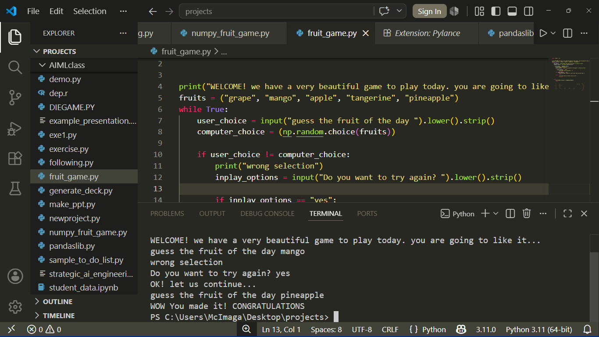

# Fruit Guessing Game 🍎

A Python terminal game. Computer picks 1 random fruit from 5 options. You guess it.

### Features
- Case-insensitive input: `Mango` or `mango` both work
- Shows computer's choice if you guess wrong + asks to retry
- Clean replay loop


### Gameplay Proof


### How to Run
```bash
python fruit_game.py
