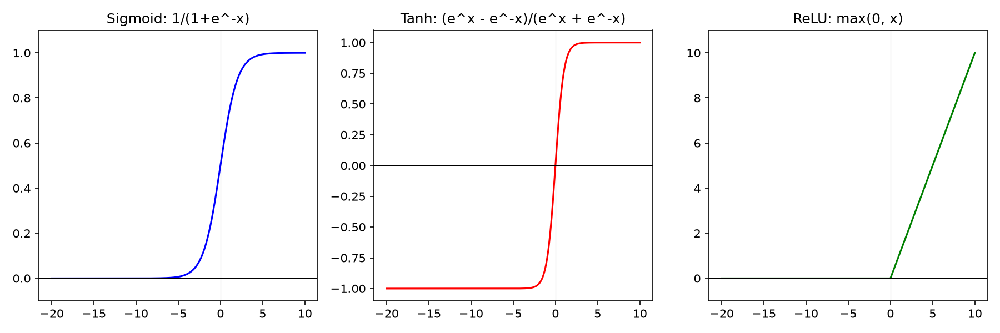

# 02: Activation Functions Visualizer

Visualized 3 core ML activation functions from x=-20 to x=10.

**Functions:**
1.  Sigmoid: $σ(x) = 1/(1 + e^-x)$ → Maps to [0, 1]
2.  Tanh: $tanh(x)$ → Maps to [-1, 1] 
3.  ReLU: $max(0, x)$ → Most used in deep learning

**Why it matters:** 
Activation functions decide if a neuron “fires”. Sigmoid/Tanh squash values. ReLU kills negatives = faster training. Understanding these = understanding how neural nets learn.

Run: `python activation_functions.py`