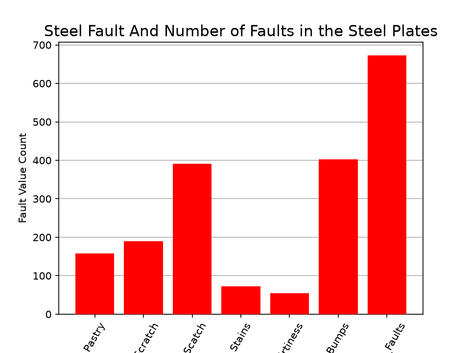

# 03 - Fault Steel Plates Classification

### **Problem Statement**
Manufacturing companies lose millions to defective steel plates.
Goal: Use the Fault Steel Plates dataset to predict 7 types of surface defects before plates ship to customers.

### **Dataset**
- **Source**: UCI Machine Learning Repository - Steel Plates Faults Dataset
- **Samples**: 1941 steel plates
- **Features**: 27 features describing shape, size, and texture
- **Target**: 7 defect types 
`Dataset link` - 

### **What We Did**
This was a team project for our AI/ML class focused on real-world data processing.

**Team Roles:**
- **Me**: Data preprocessing pipeline, EDA visualizations
- **[Teammate 1]**: Feature selection and correlation analysis
- **[Teammate 2]**: Baseline modeling and evaluation

**Key Steps:**
1. **EDA**: Found heavy class imbalance. one defect type made up dominated all faults.
2. **Data Cleaning**: checked for missing values, checked for  duplicates, scaled features with StandardScaler


### **Key Insights**
- Features `X_Perimeter` and `Y_Perimeter` were highly correlated with defect type.
- Real takeaway: 90% of ML work is cleaning data before modeling.
- The bar chart presents the frequency distribution of fault categories in the Engineering_Faults dataset. '`Other_Faults`' is the most common defect (approximately 673 cases), followed by 'Bumps' (402) and '`K_Scratch`' (391), while '`Stains`' (72) and '`Dirtiness`' (55) occur least frequently. This indicates a pronounced class imbalance, where a few fault types dominate the dataset. 



### **Tech Stack**
`Python` `Pandas` `NumPy` `Matplotlib` `Scikit-learn`

### **How to Run**
```bash
pip install pandas numpy matplotlib seaborn scikit-learn
python fault_steel_plates.py